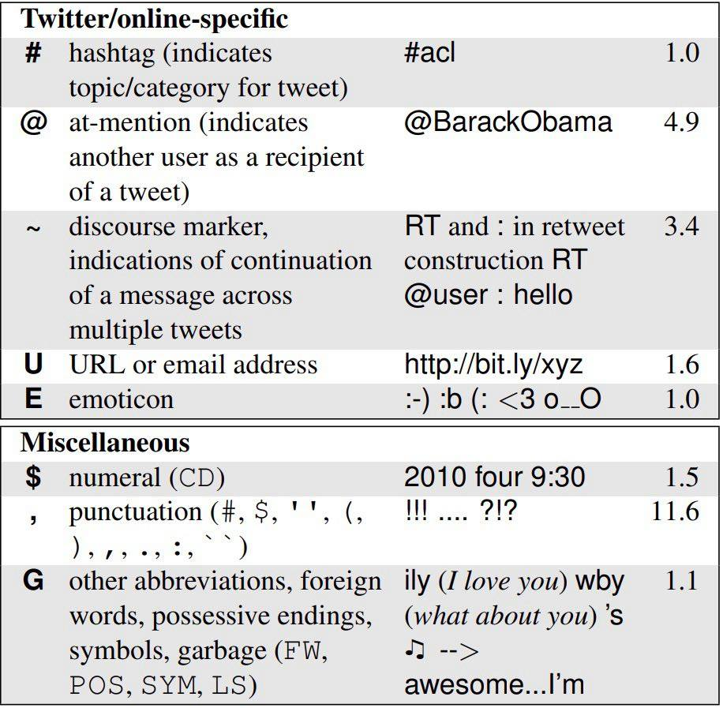

<!-- README.md is generated from README.Rmd. Please edit that file -->

```{r setup, include = FALSE}
knitr::opts_chunk$set(
  collapse = TRUE,
  comment = "#>",
  fig.path = "man/figures/README-",
  out.width = "100%"
)
```
# twokenizer

The goal of twokenizer is to provide a wrapper around Ark-TweetNLP's part-of-speech tagger, which was trained specifically for the tagging of tweets, along with an easier download function for both the tagger itself and the alternative models provided, which can also be found here: http://www.cs.cmu.edu/~ark/TweetNLP/

## Installation

You can install twokenizer as follows:

``` r
devtools::install_github("b05102139/twokenizer")
```

## Example

the twokenizer function requires two arguments: the location of the ark-tweet-nlp-0.3.2 folder, downloadable with the download_twokenizer function, and the tweet to be tagged. An addtional parameter exists if users wish to change the tagger to one of the two alternative models provided by the project, the Penn Treebank-style model and the NPSChat IRC model, also downloadable via the download function. Below is an example of the standard tagger:

```{r example}
library(twokenizer)
twokenizer(tagger_location = "~/ark-tweet-nlp-0.3.2",
           text = "ikr smh he asked fir yo last name so he can add u on fb lololol")
```

The function returns a dataframe with the three columns of "word," "tag," and "confidence". Below is a table taken from the original paper by Gimpel et al. on what the tags mean:

```{r, out.width = "460px", fig.align = "center", echo = F}
knitr::include_graphics("man/figures/tweebo_1.jpg")
knitr::include_graphics("man/figures/tweebo_2.jpg")

```

Alternatively, one may choose to employ Penn Treebank tags if the model is downloaded:
```{r}
library(twokenizer)
twokenizer(tagger_location = "~/ark-tweet-nlp-0.3.2",
           text = "ikr smh he asked fir yo last name so he can add u on fb lololol",
           model_location = "~/ritter_model")
```

The download_twokenizer function works as follows:
```{r, eval=F}
library(twokenizer)
download_twokenizer("~/Documents", "base")

#MUST DOWNLOAD "base" FIRST:
download_twokenizer("~/Documents", "penn")
download_twokenizer("~/Documents", "irc")
```
The downloader takes two arguments: the location where you wish to put the tagger (which needs to be specified in the tagger for it to work), and the model to be downloaded. The base model is required to be downloaded before the other two.

## References
K. Gimpel, N. Schneider, B. O’Connor, D. Das, D. Mills,
J. Eisenstein, M. Heilman, D. Yogatama, J. Flanigan,
and N. A. Smith. 2011. Part-of-speech tagging for
Twitter: Annotation, features, and experiments. In
*Proc. of ACL*.
