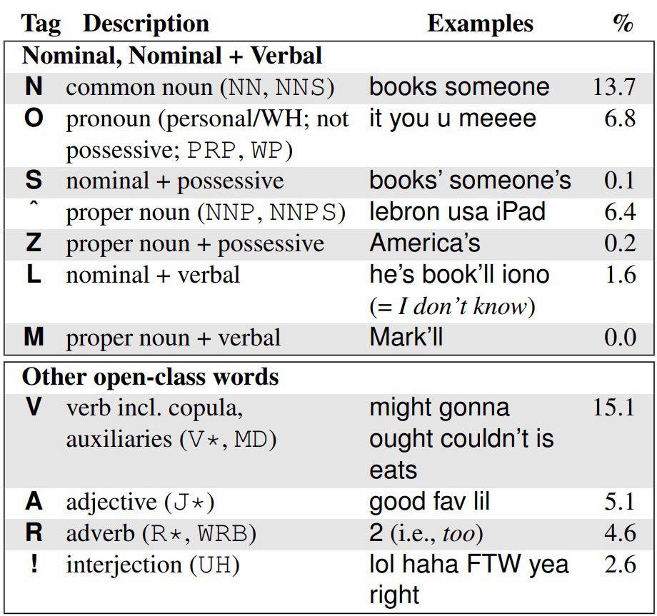
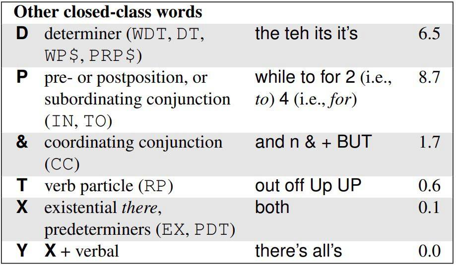
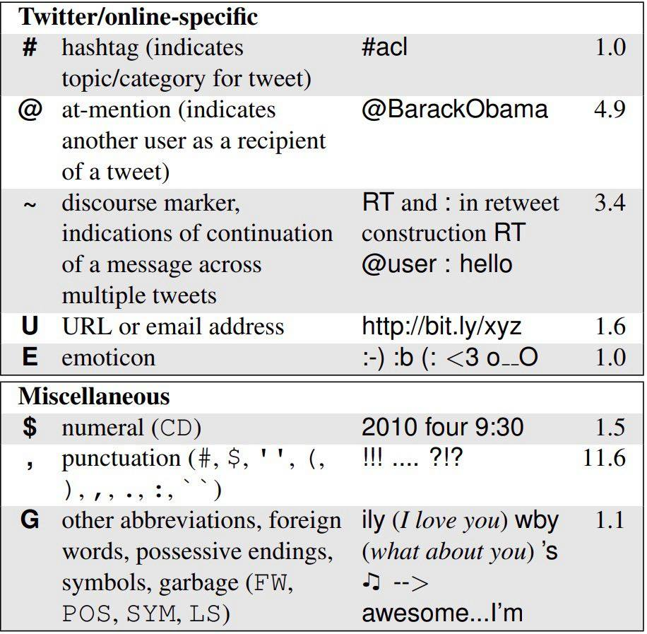

<!-- README.md is generated from README.Rmd. Please edit that file -->

# twokenizer

The goal of twokenizer is to provide a wrapper around Ark-TweetNLP’s
part-of-speech tagger, which was trained specifically for the tagging of
tweets, along with an easier download function for both the tagger
itself and the alternative models provided, which can also be found
here: <http://www.cs.cmu.edu/~ark/TweetNLP/>

## Installation

You can install twokenizer as follows:

``` r
devtools::install_github("b05102139/twokenizer")
```

## Example

the twokenizer function requires two arguments: the location of the
ark-tweet-nlp-0.3.2 folder, downloadable with the download\_twokenizer
function, and the tweet to be tagged. An addtional parameter exists if
users wish to change the tagger to one of the two alternative models
provided by the project, the Penn Treebank-style model and the NPSChat
IRC model, also downloadable via the download function. Below is an
example of the standard tagger:

``` r
library(twokenizer)
twokenizer(tagger_location = "~/ark-tweet-nlp-0.3.2",
           text = "ikr smh he asked fir yo last name so he can add u on fb lololol")
#>       word tag confidence
#> 1      ikr   !     0.8047
#> 2      smh   G     0.9340
#> 3       he   O     0.9960
#> 4    asked   V     0.9975
#> 5      fir   P     0.5545
#> 6       yo   D     0.6272
#> 7     last   A     0.9871
#> 8     name   N     0.9998
#> 9       so   P     0.9838
#> 10      he   O     0.9981
#> 11     can   V     0.9997
#> 12     add   V     0.9997
#> 13       u   O     0.9978
#> 14      on   P     0.9585
#> 15      fb   ^     0.9306
#> 16 lololol   !     0.9658
```

The function returns a dataframe with the three columns of “word,”
“tag,” and “confidence”. Below is a table taken from the original
paper by Gimpel et al. on what the tags
mean:



Alternatively, one may choose to employ Penn Treebank tags if the model
is downloaded:

``` r
library(twokenizer)
twokenizer(tagger_location = "~/ark-tweet-nlp-0.3.2",
           text = "ikr smh he asked fir yo last name so he can add u on fb lololol",
           model_location = "~/ritter_model")
#>       word tag confidence
#> 1      ikr  UH     0.8971
#> 2      smh  UH     0.9848
#> 3       he PRP     0.9923
#> 4    asked VBD     0.9245
#> 5      fir  NN     0.5381
#> 6       yo  UH     0.5392
#> 7     last  JJ     0.9779
#> 8     name  NN     0.9906
#> 9       so  IN     0.7546
#> 10      he PRP     0.9950
#> 11     can  MD     0.9901
#> 12     add  VB     0.9844
#> 13       u PRP     0.9885
#> 14      on  IN     0.9884
#> 15      fb NNP     0.9475
#> 16 lololol  UH     0.8848
```

The download\_twokenizer function works as follows:

``` r
library(twokenizer)
download_twokenizer("~/Documents", "base")

#MUST DOWNLOAD "base" FIRST:
download_twokenizer("~/Documents", "penn")
download_twokenizer("~/Documents", "irc")
```

The downloader takes two arguments: the location where you wish to put
the tagger (which needs to be specified in the tagger for it to work),
and the model to be downloaded. The base model is required to be
downloaded before the other two.

## References

K. Gimpel, N. Schneider, B. O’Connor, D. Das, D. Mills, J. Eisenstein,
M. Heilman, D. Yogatama, J. Flanigan, and N. A. Smith. 2011.
Part-of-speech tagging for Twitter: Annotation, features, and
experiments. In *Proc. of ACL*.
